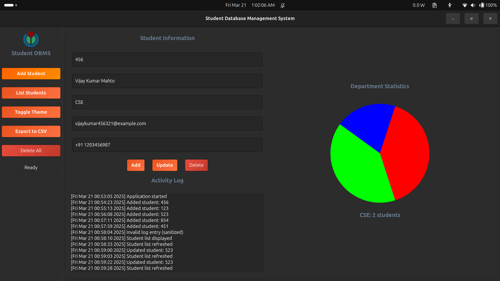
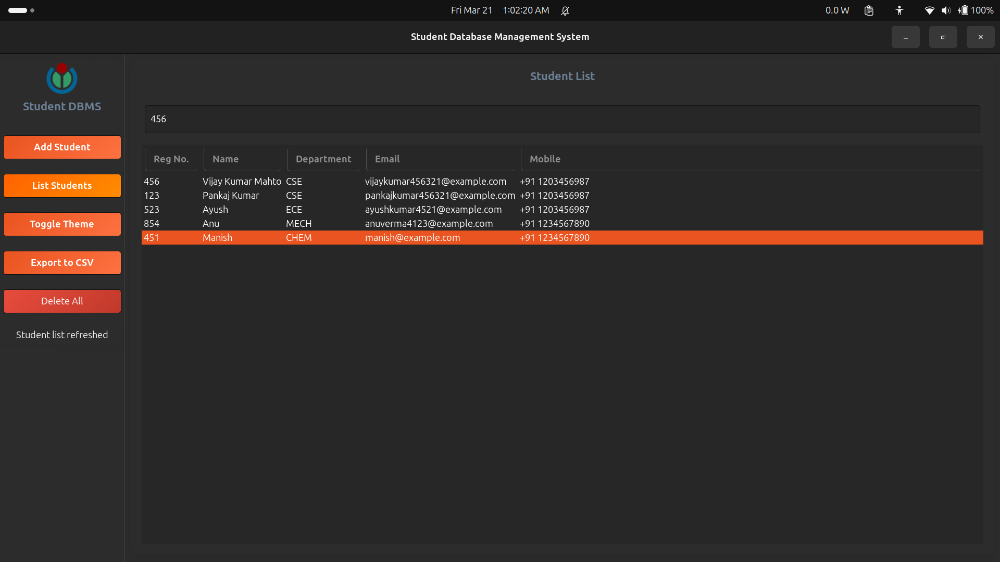
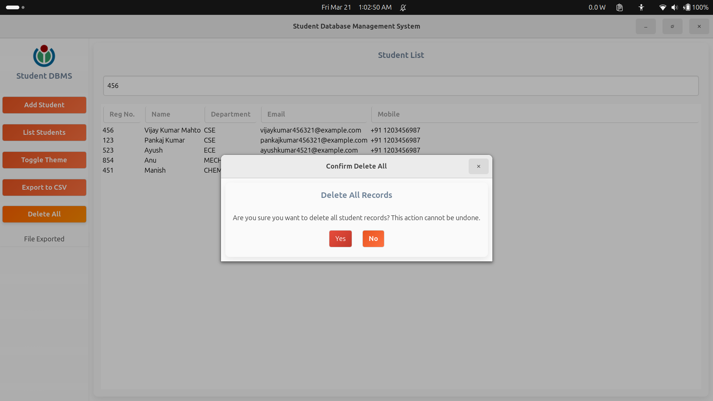
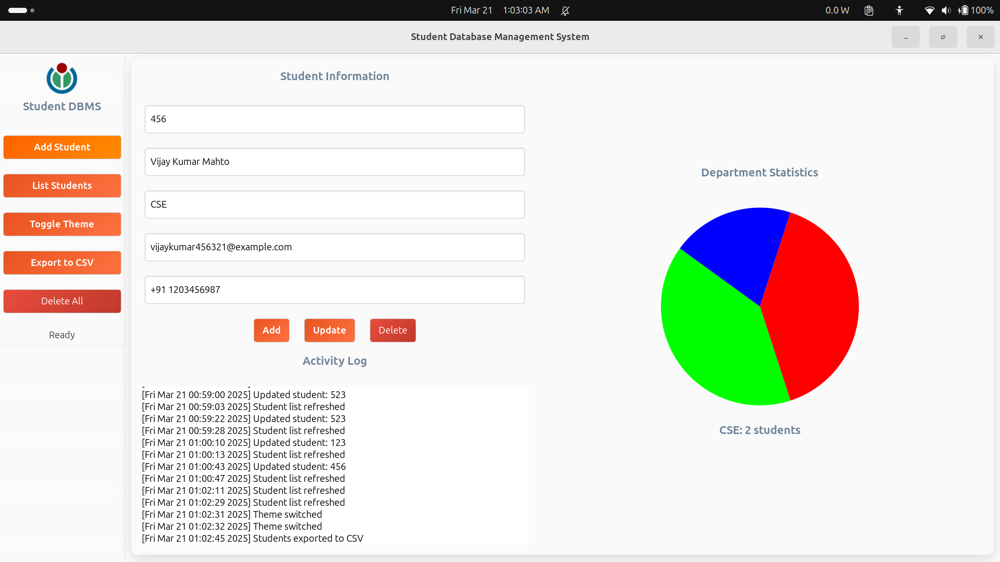

# StudentDBMS 📚👨‍🎓


> *A modern, intuitive student database management system built with C and GTK4.*

<div align="center">
  
  <br>
  <i>Simplifying student records management for educational institutions</i>
</div>


## Table of Contents
- [Features](#-Features)
- [Screenshots](#-Screenshots)
- [Tech Stack](#-Tech-Stack)
- [Requirements](#-Requirements)
- [Installation](#-Installation)
- [Usage](#-Usage)
- [Project Structure](#-Project-Structure)
- [Contributing](#-contributing)
- [Author](#-Author)
- [Contact](#-contact)

## ✨ Features

- **📝 Student Management** - Add, update, delete, and list student records with ease
- **📊 Data Visualization** - View department-wise student distribution through interactive pie charts
- **🔍 Intuitive UI** - User-friendly interface with sidebar navigation and responsive design
- **📤 Export Functionality** - Export student data to CSV with a single click
- **🔄 Activity Logging** - Real-time activity tracking with persistent logs
- **🌓 Light/Dark Theme** - Toggle between themes for different lighting conditions
- **🔉 Voice Feedback** - Optional voice synthesis for accessibility (requires eSpeak)
- **⌨️ Keyboard Shortcuts** - Enhance productivity with convenient keyboard controls

## 🖼️ Screenshots

<div align="center">




</div>

## 🛠️ Tech Stack

- **Core:** C programming language
- **GUI:** GTK4 (GTK 4.0 or newer)
- **Database:** SQLite3
- **Graphics:** Cairo
- **Voice Synthesis:** eSpeak (optional)
- **Build System:** CMake

## 📋 Requirements

- GCC or compatible C compiler
- GTK4 development libraries (`libgtk-4-dev`)
- SQLite3 development libraries (`libsqlite3-dev`)
- Cairo development libraries (`libcairo2-dev`)
- CMake (3.10 or newer)
- eSpeak development libraries (`libespeak-dev`) - optional for voice feedback

## 🚀 Installation

### Ubuntu/Debian

#### Install dependencies
```sh
sudo apt update
sudo apt install build-essential cmake libgtk-4-dev libsqlite3-dev libcairo2-dev libespeak-dev
```

#### Clone the repository
```sh
git clone https://github.com/yourusername/StudentDBMS.git
cd StudentDBMS
```

#### Build the project
```sh
mkdir -p cmake-build-debug
cd cmake-build-debug
cmake ..
make
```

#### Run the application
```sh
./StudentDBMS
```

### Other platforms

Support for Windows(10+) and macOS.

## 🎮 Usage

### Main Interface

The application features a sidebar with the following options:

- **Add Student** - Open the form to add a new student record
- **List Students** - View all students in a tabular format
- **Toggle Theme** - Switch between light and dark themes
- **Export to CSV** - Export all student data to CSV format
- **Delete All** - Remove all student records (with confirmation)

### Keyboard Shortcuts

- `Ctrl+S` - Save/Add student
- `Ctrl+M` - Toggle maximize window
- More shortcuts coming soon!

### Student Management

1. **Adding a student:**
    - Click on "Add Student" in the sidebar
    - Fill in the registration number, name, department, email, and mobile number
    - Click "Save" or press `Ctrl+S`

2. **Editing a student:**
    - Go to "List Students" view
    - Double-click on a student record to edit
    - Modify the details and click "Update"

3. **Deleting a student:**
    - Select a student in the list view
    - Click "Delete" to remove the individual record

4. **Exporting data:**
    - Click "Export to CSV" in the sidebar
    - Data will be exported to `data/students_export.csv`

## 📂 Project Structure

```
StudentDBMS/
├── assets/              # Assets like logo.png
├── src/
│   ├── db/              # Database operations (db.c, db.h)
│   ├── gui/             # GUI components (main_window.c, form_view.c, list_view.c)
│   ├── utils/           # Utilities (voice.c, themes.c, logs.c, gui_utils.c)
│   ├── visuals/         # Chart rendering (charts.c)
│   └── main.c           # Entry point
├── CMakeLists.txt       # CMake configuration
└── README.md            # Project documentation
```

## 🤝 Contributing

Feel free to fork this repository and submit pull requests with improvements!

#### Fork the repository

#### Create your feature branch 
```sh 
git checkout -b feature/amazing-feature
```
#### Commit your changes
```sh 
git commit -m 'Add some amazing feature'
```

#### Push to the branch 
```sh 
git push origin feature/amazing-feature
```

#### Open a Pull Request

## 👥 Author

- **Your Name** - Vijay Kumar Mahto

## 📞 Contact

For questions, suggestions, or issues:
- **Email:** [vijaykumar961403@gmail.com](mailto:vijaykumar961403@gmail.com)
- **LinkedIn:** [Vijay Kumar Mahto](https://linkedin.com/in/vijay-kumar-mahto-872901298/)
- **GitHub**: [vijay-kumar-mahto](https://github.com/vijay-kumar-mahto)
- **Issues**: [Report a bug](https://github.com/vijay-kumar-mahto/brick-breaker/issues)
